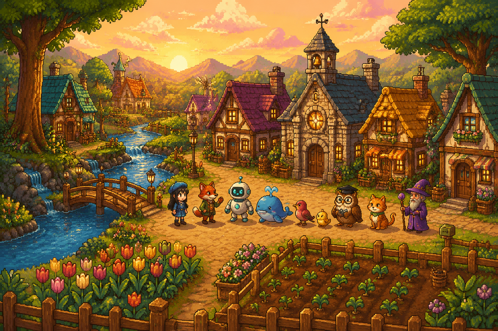
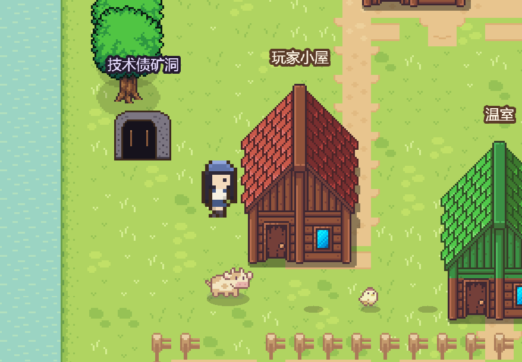
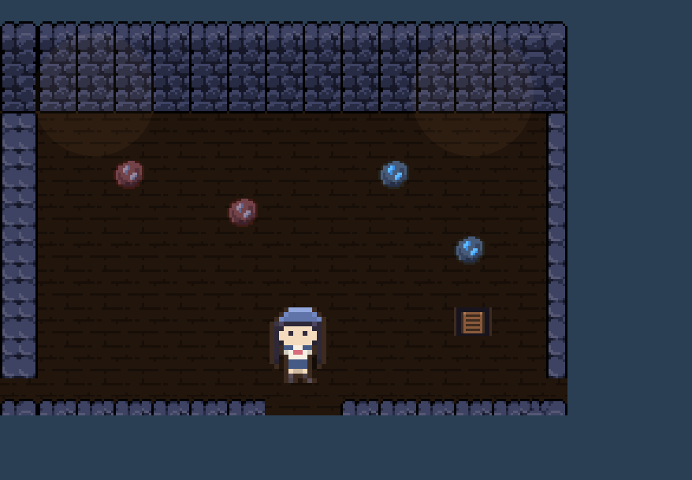
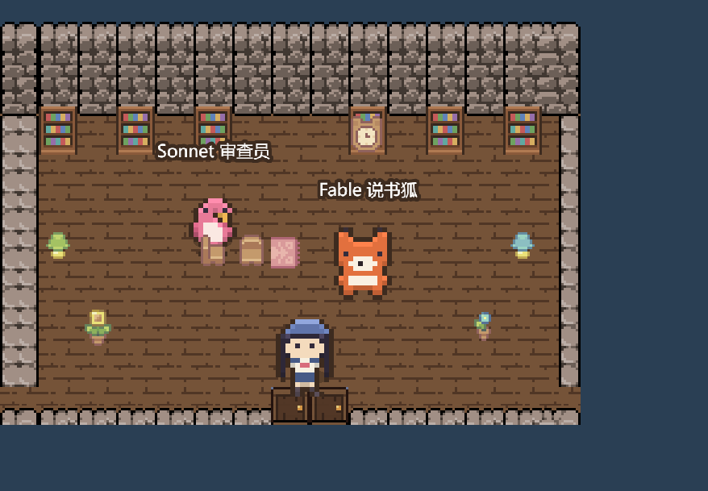

# 新路谷物语 · Newroad Valley

**A Stardew-style pixel town that runs on a real local work system.**
一座星露谷风格的像素小镇，背后是一套真实运转的本地工作系统：agent 协作、长期记忆、wiki 知识塔、科研看板、技能配方与代码仓库。

[](https://github.com/appleweiping/newroad-valley/releases)
[](https://newroad-valley.vercel.app/play.html)
[](https://newroad-valley.vercel.app/play.html)

**▶ 立刻游玩 Play: https://newroad-valley.vercel.app/play.html**
**👀 观战链接 Spectate (read-only): https://newroad-valley.vercel.app/play.html?spectate=1**

| | | |
| --- | --- | --- |
|  |  |  |
| 小镇与农场 the town | 技术债矿洞 the debt mines | 记忆图书馆 the library stacks |

## What is this?

Walk a cozy pixel valley where **work is the world**:

| In the game | In reality |
| --- | --- |
| 记忆图书馆 Memory Library | agentmemory (localhost:3111) — 590+ shelved memories |
| 知识塔 Knowledge Tower | WEIPING_WIKI — 1,100+ markdown pages |
| 研究大厅 Research Hall | research boards (metadata only, never contents) |
| 技能工坊 Skill Workshop | 400+ skill recipes from SKILL-INDEX.md |
| 代码工场 Code Workshop | live `git` status — fresh commits burst confetti |
| 市政厅 Town Hall | service health: memory engine, bridge, watchdogs |
| 农场 Farm | tasks as crops: plant = create, water = progress, harvest = done |
| 技术债矿洞 The Mines | ore = real TODO/FIXME comments & git hotspots, three levels deep |
| 河流 The river | fish = recent system logs; an ERROR line is the king fish |
| 公告板 Notice board | live agentmemory signals — the receiving NPC runs to read them |
| 8 NPC 居民 | real agents with their own species: Opus(sage) Codex(robot) Sonnet(songbird) Haiku(chick) DeepSeek(whale) ARIS(owl) PixelCat(cat) Fable(fox) |

## Features by version

- **v3 · 星露谷式重生** — true 16-px art pipeline, procedural town, dual
  LIVE/DEMO data modes, eight resident species, landing site.
- **v4 · 室内与活水** — six enterable interiors, crops bound to real tasks,
  NPC schedules with A* pathfinding, ask-the-agent dialogue, CC0 audio, saves.
- **v5 · 矿洞与季节** — tech-debt mines, log fishing, four seasons with
  snowfall, release-day festivals, achievements + almanac.
- **v6 · 远行与同行** — virtual joystick & touch, installable offline PWA,
  read-only spectate links, live multi-agent signal visualization.
- **v7 · 活水加深** — memory events puff the library chimney, commits burst
  confetti, season-weighted weather (rain waters crops), NPC small talk,
  take quests via dialogue.
- **v8 · 玩法纵深** — inventory, shipping bin with morning payouts, the
  seven-page Valley Handbook, build-point shop (Watering Can II, lamps,
  flowerbeds), stamina, museum donations.
- **v9 · 打磨与开放** — Fable's onboarding quest chain, settings panel
  (volume/language/zoom), README overhaul, the five-release night finale.

Two data modes, automatically detected:

- **联机 LIVE** — on the owner's machine the game talks to a local FastAPI
  bridge (`backend/`, port 8000) that aggregates the real systems.
- **演示 DEMO** — anywhere else (e.g. the public site) it loads sanitized
  snapshots from `web/public/demo/`. Research content is fictionalized;
  private data never leaves the machine.

## Play locally

```bash
# web client (game + landing site)
cd web && npm install && npm run dev      # http://localhost:5173

# optional: live bridge for real data
cd backend && pip install -r requirements.txt
python -m uvicorn main:app --port 8000
```

Controls: WASD / arrows / click-to-walk · drag to pan · wheel to zoom ·
`E` interact · `F` refocus · 📖 handbook · ⚙ settings.
On touch devices a virtual joystick appears automatically.

## Architecture

```
web/                 Vite + TypeScript
├─ src/game/         Phaser 3 world: town / interiors / mines, day-night,
│                    seasons, weather, signals, pulse reactions
├─ src/ui/           React overlay: HUD, dialogue, Valley Handbook, fishing
├─ src/shared/       typed bus · dual-mode api · save v3 · touch state
├─ src/landing/      interactive landing page (zh/en)
└─ public/demo/      sanitized demo snapshots (+ manifest, sw.js for PWA)

backend/             FastAPI local bridge (LIVE mode only)
├─ main.py           v2-era adapters + hardened job queue
└─ town_api.py       /api/town/* read-only aggregation: memory / wiki /
                     skills / code / debt (SWR cache) / logs / signals /
                     pulse / festival / farm ledger / dialogue / e2e sink

tools/
├─ build-assets.py   asset pipeline: licensed packs → recolors, buildings,
│                    props (ore nodes, shipping bin…), manifest
├─ gen-banner.py     README banner via gpt-image-2
└─ gen-icons.py      PWA icons from the banner

workspace/           runtime artifacts (gitignored): task ledger, e2e evidence
```

**In-page E2E harness**: open `/play.html?v4test=1` with the bridge running —
it drives 27 steps (interiors, farming, mining, fishing, seasons, touch,
signals, weather, chitchat, quests, economy, tutorial, settings…) and streams
JSONL + canvas screenshots to `workspace/`, so verification survives flaky
browser tooling.

## Art & licenses

True 16-px pixel art assembled from licensed packs, processed by
`tools/build-assets.py`:

- **Sprout Lands** + UI © Cup Nooble — terrain, water, farm, character base, dialogs
- **Cute Fantasy RPG** © Kenmi — house (building family base), trees, animals
- **Mystic Woods** © Game Endeavor — interiors
- **LPC crops** (CC-BY-SA) · **Kenney** packs (CC0)

Free-tier licenses forbid redistribution, so **raw packs and derived sprites
are not in this repo** (`art/packs/`, `web/public/assets/core/` are
gitignored). They ship only inside deployed builds. Clone + download packs +
run the pipeline to regenerate. This is a non-commercial portfolio project.

## History

| version | name | release |
| --- | --- | --- |
| v9 | 打磨与开放 Polish & Onboarding | [v9.0.0](https://github.com/appleweiping/newroad-valley/releases/tag/v9.0.0) |
| v8 | 玩法纵深 Inventory & Economy | [v8.0.0](https://github.com/appleweiping/newroad-valley/releases/tag/v8.0.0) |
| v7 | 活水加深 Living Integrations | [v7.0.0](https://github.com/appleweiping/newroad-valley/releases/tag/v7.0.0) |
| v6 | 远行与同行 Mobile & Spectate | [v6.0.0](https://github.com/appleweiping/newroad-valley/releases/tag/v6.0.0) |
| v5 | 矿洞与季节 Mines & Seasons | [v5.0.0](https://github.com/appleweiping/newroad-valley/releases/tag/v5.0.0) |
| v4.x | 室内与活水 Interiors & Living Data | [v4.1.0](https://github.com/appleweiping/newroad-valley/releases/tag/v4.1.0) |
| v2 | Godot 绘本时代（已封存） | tag `v2-godot-era` |

v5 → v9 shipped in one autonomous overnight run (2026-06-12), each with a
full verify → build → deploy → leak-scan → release loop. See
[ROADMAP.md](ROADMAP.md) for the build log.

## Safety rails

- Read-only adapters everywhere; writes are confirmation-gated and
  project-local (`workspace/`).
- Research contents are never read — names and timestamps only.
- Keys live in env vars / DPAPI vault; never in code, logs, memories or git.
- Every release ships only after a secret-pattern scan of the full diff.

---

新路谷物语 — *plant your real work into a pixel valley.*
