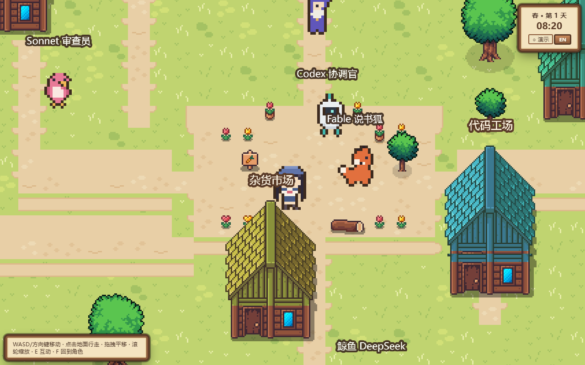

# 新路谷物语 · Newroad Valley

**A Stardew-style pixel town that runs on a real local work system.**
一座星露谷风格的像素小镇，背后是一套真实运转的本地工作系统：agent 协作、长期记忆、wiki 知识塔、科研看板、技能配方与代码仓库。



**▶ Play it now: https://newroad-valley.vercel.app**

## What is this?

Walk a cozy pixel valley where **work is the world**:

| In the game | In reality |
| --- | --- |
| 记忆图书馆 Memory Library | agentmemory (localhost:3111) — 586 shelved memories, 53 MCP tools |
| 知识塔 Knowledge Tower | WEIPING_WIKI — 1,100+ markdown pages |
| 研究大厅 Research Hall | `D:\Research` boards (metadata only, never contents) |
| 技能工坊 Skill Workshop | 400+ skill recipes from SKILL-INDEX.md |
| 代码工场 Code Workshop | live `git` status of every company repo |
| 市政厅 Town Hall | service health: memory engine, bridge, watchdogs |
| 杂货市场 Market | model channels (key *presence* only — never values) |
| 农场 Farm | tasks as crops: plant = create, water = progress, harvest = done |
| 8 NPC 居民 | real agents, each with its own species: Opus(sage), Codex(robot), Sonnet(songbird), Haiku(chick), DeepSeek(whale), ARIS(owl), PixelCat(cat), Fable(fox) |

Two data modes, automatically detected:

- **联机 LIVE** — on the owner's machine the game talks to a local FastAPI
  bridge (`backend/`, port 8000) that aggregates the real systems.
- **演示 DEMO** — anywhere else (e.g. the public site) it loads sanitized
  snapshots from `web/public/demo/`. Research content is fictionalized;
  private data never leaves the machine.

## Play

```bash
# web client (game + landing site)
cd web && npm install && npm run dev      # http://localhost:5173

# optional: live bridge for real data
cd backend && pip install -r requirements.txt
python -m uvicorn main:app --port 8000
```

Controls: WASD / arrows / click-to-walk · drag to pan · wheel to zoom ·
`E` interact · `F` refocus camera.

## Architecture

```
web/                Vite + TypeScript
├─ src/game/        Phaser 3 world: procedural town, NPCs, day/night
├─ src/ui/          React overlay: Stardew-style wooden panels
├─ src/landing/     interactive landing page (zh/en)
└─ public/demo/     sanitized demo snapshots

backend/            FastAPI local bridge (LIVE mode only)
├─ main.py          v2-era adapters + hardened job queue (retry/backoff,
│                   idempotent dedup)
└─ town_api.py     /api/town/* read-only aggregation for the panels

data/               JSON registries (agents, buildings, quests…)
tools/
├─ build-assets.py  asset pipeline: licensed packs → recolored NPC variants,
│                   hue/twin/tall building family, manifest
└─ inspect-assets.py annotated contact sheets for tile mapping

art/packs/          raw third-party packs (gitignored, see licenses below)
```

## Art & licenses

True 16-px pixel art assembled from licensed packs, processed by
`tools/build-assets.py`:

- **Sprout Lands** + UI © Cup Nooble — terrain, water, farm, character base, dialogs
- **Cute Fantasy RPG** © Kenmi — house (building family base), trees, animals
- **Mystic Woods** © Game Endeavor — interiors
- **LPC crops** (CC-BY-SA) · **Kenney** packs (CC0)

Free-tier licenses forbid redistribution, so **raw packs and derived sprites
are not in this repo** (`art/packs/`, `web/public/assets/core/` are
gitignored). They ship only inside deployed builds. Clone + download packs +
run the pipeline to regenerate. This is a non-commercial portfolio project.

## History

- `v2-godot-era` tag — the previous Godot 4.6 + anime-storybook incarnation
  (35 buildings, 180+ endpoint backend). The backend survived into v3;
  the client was rebuilt from scratch as a web game.
- v1 (a16z fork era) lives in the older branches.

## Safety rails

- Read-only adapters everywhere; writes are confirmation-gated and
  project-local (`workspace/`).
- `D:\Research` contents are never read — names and timestamps only.
- Keys live in env vars / DPAPI vault; never in code, logs, memories or git.

---

新路谷物语 — *plant your real work into a pixel valley.*
